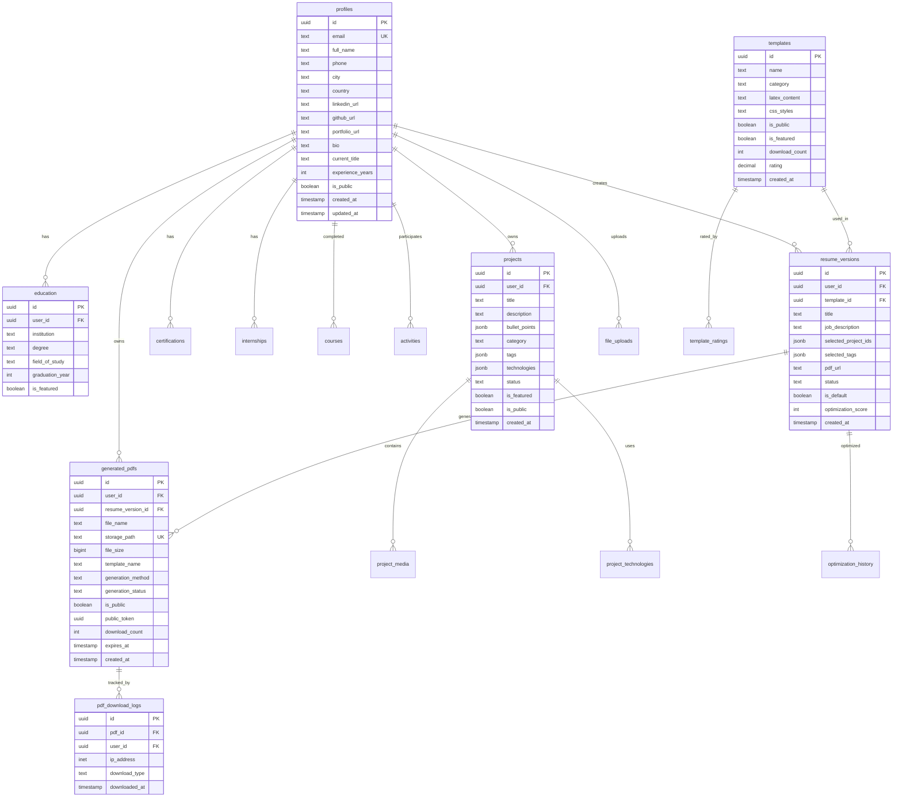
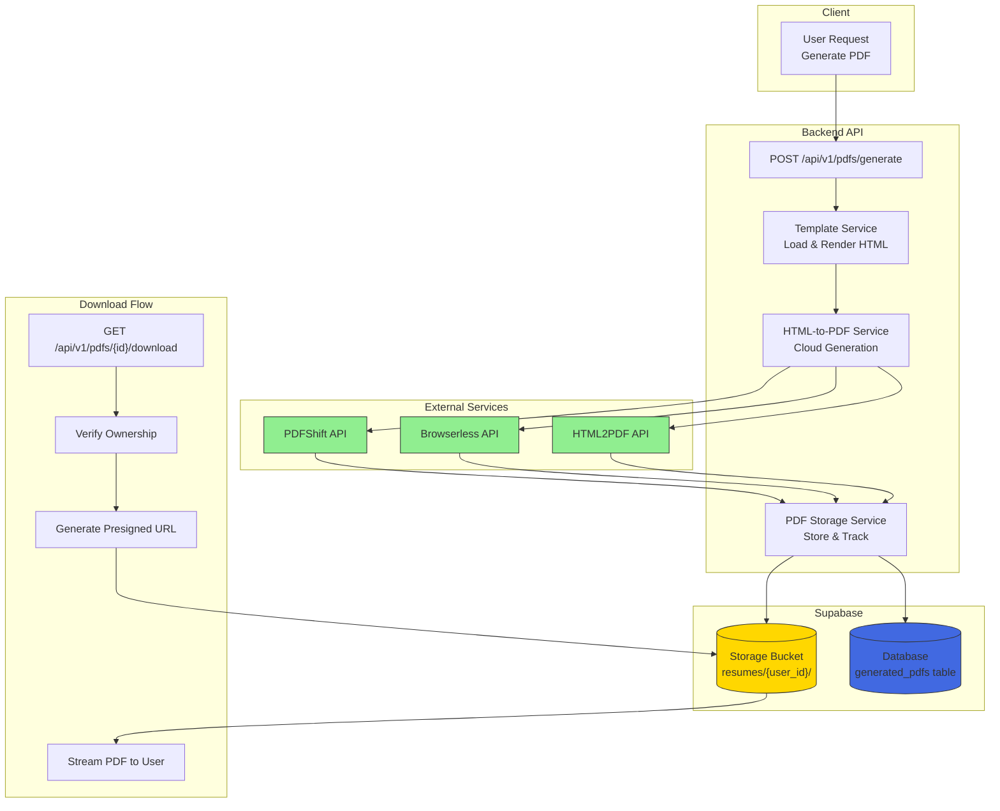
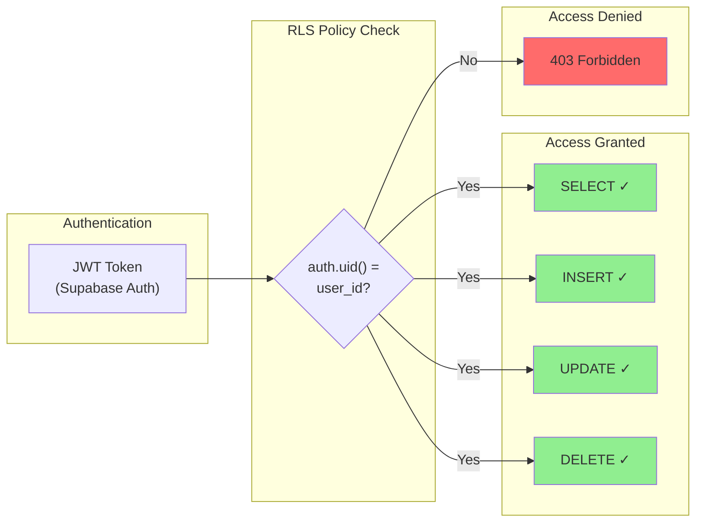
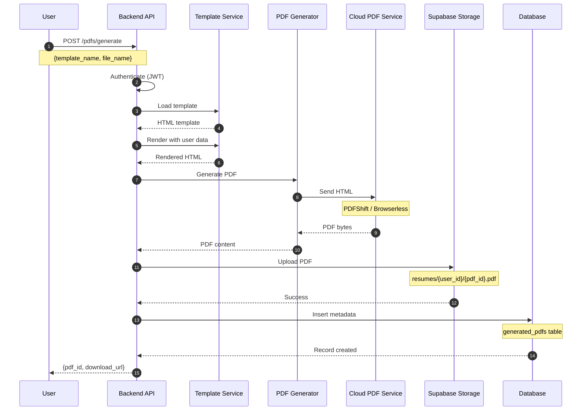
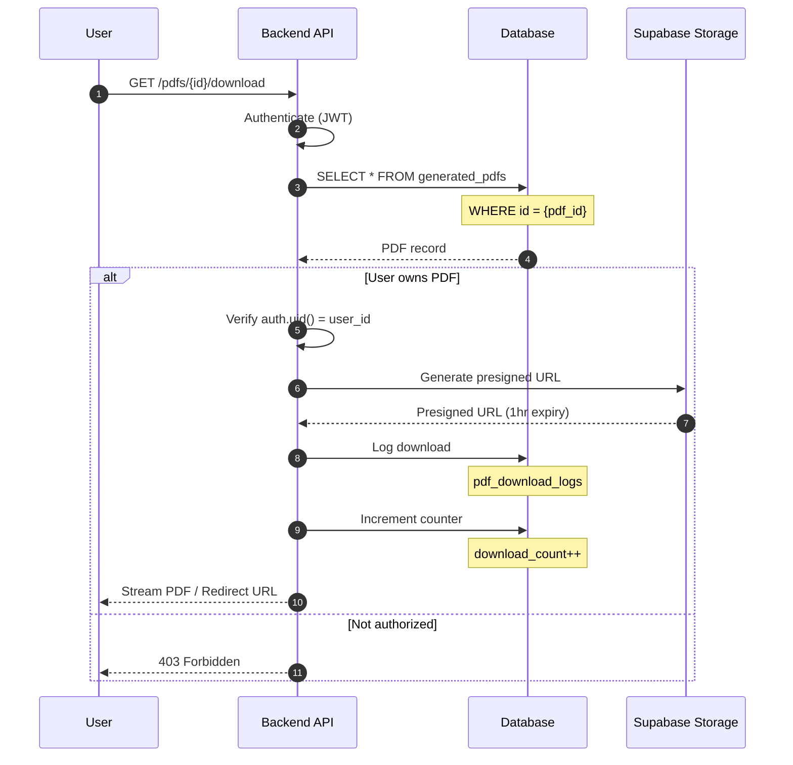
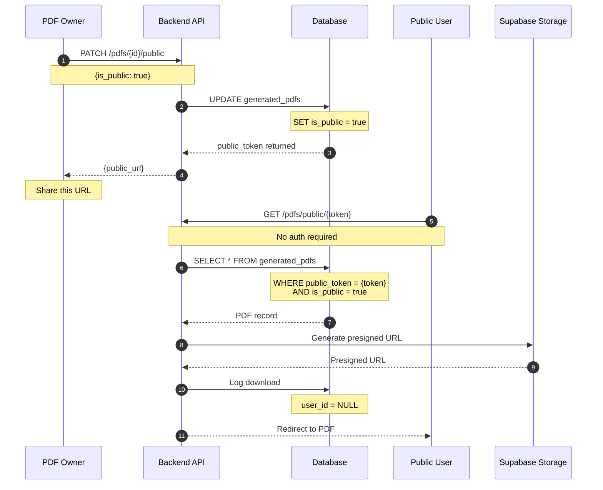

# Resume Twin - Database Architecture Documentation

## Overview

This document provides comprehensive documentation of the Resume Twin database architecture, including entity relationships, schema descriptions, data flow diagrams, and access control policies.

## Table of Contents

1. [Database Overview](#database-overview)
2. [Entity Relationship Diagram](#entity-relationship-diagram)
3. [PDF Storage Architecture](#pdf-storage-architecture)
4. [Table Descriptions](#table-descriptions)
5. [Access Control & Security](#access-control--security)
6. [Data Flow Diagrams](#data-flow-diagrams)
7. [API Integration](#api-integration)

---

## Database Overview

Resume Twin uses **PostgreSQL** via **Supabase** as its primary database. The system is designed for:

- **User Profile Management**: Store professional information, education, and experience
- **Project Portfolio**: Manage tagged project portfolios for resume customization  
- **Resume Generation**: Template-based resume creation with AI optimization
- **Secure PDF Storage**: User-owned PDFs stored in Supabase Storage (S3-compatible)

### Technology Stack

| Component | Technology |
|-----------|------------|
| Database | PostgreSQL 15+ (Supabase) |
| Storage | Supabase Storage (S3-compatible) |
| Authentication | Supabase Auth (JWT) |
| Row-Level Security | PostgreSQL RLS Policies |

---

## Entity Relationship Diagram



---

## PDF Storage Architecture

### Storage Flow Diagram



### Storage Path Convention

```
resumes/
├── {user_id_1}/
│   ├── {pdf_id_1}.pdf
│   ├── {pdf_id_2}.pdf
│   └── {pdf_id_3}.pdf
├── {user_id_2}/
│   ├── {pdf_id_4}.pdf
│   └── {pdf_id_5}.pdf
└── ...
```

**Path Format**: `resumes/{user_id}/{pdf_id}.pdf`

This structure ensures:
- User isolation at the folder level
- Easy cleanup when user is deleted
- Efficient listing of user's PDFs
- RLS policies can verify ownership via path

---

## Table Descriptions

### Core Tables

#### `generated_pdfs`

Stores metadata for all PDFs generated by users.

| Column | Type | Nullable | Description |
|--------|------|----------|-------------|
| `id` | UUID | No | Primary key, auto-generated |
| `user_id` | UUID | No | FK to profiles.id - **owner of the PDF** |
| `resume_version_id` | UUID | Yes | FK to resume_versions.id (optional link) |
| `file_name` | TEXT | No | Display name: "John_Doe_Resume.pdf" |
| `storage_path` | TEXT | No | S3 path: "resumes/{user_id}/{pdf_id}.pdf" |
| `file_size` | BIGINT | No | Size in bytes |
| `mime_type` | TEXT | Yes | Default: "application/pdf" |
| `template_name` | TEXT | Yes | Template used (e.g., "modern_resume") |
| `template_type` | TEXT | Yes | "html" or "latex" |
| `generation_method` | TEXT | No | "pdfshift", "browserless", "html2pdf", "weasyprint" |
| `generation_time_ms` | INTEGER | Yes | Generation time in milliseconds |
| `generation_status` | TEXT | Yes | "pending", "generating", "completed", "failed" |
| `error_message` | TEXT | Yes | Error details if generation failed |
| `content_hash` | TEXT | Yes | SHA-256 hash for deduplication |
| `is_public` | BOOLEAN | Yes | Default: false - allows public sharing |
| `public_token` | UUID | Yes | Token for public sharing URL |
| `download_count` | INTEGER | Yes | Default: 0 - tracks downloads |
| `last_downloaded_at` | TIMESTAMPTZ | Yes | Last download timestamp |
| `expires_at` | TIMESTAMPTZ | Yes | Auto-delete after this time (optional) |
| `created_at` | TIMESTAMPTZ | Yes | Creation timestamp |
| `updated_at` | TIMESTAMPTZ | Yes | Last update timestamp |

**Indexes**:
- `idx_generated_pdfs_user_id` - Fast lookup by user
- `idx_generated_pdfs_user_created` - User's recent PDFs
- `idx_generated_pdfs_storage_path` - S3 operations
- `idx_generated_pdfs_public_token` - Public sharing (partial index)
- `idx_generated_pdfs_expires_at` - Cleanup expired PDFs (partial index)

#### `pdf_download_logs`

Audit log for all PDF download events.

| Column | Type | Nullable | Description |
|--------|------|----------|-------------|
| `id` | UUID | No | Primary key |
| `pdf_id` | UUID | No | FK to generated_pdfs.id |
| `user_id` | UUID | Yes | FK to profiles.id (NULL for public downloads) |
| `ip_address` | INET | Yes | Downloader's IP address |
| `user_agent` | TEXT | Yes | Browser/client info |
| `download_type` | TEXT | Yes | "direct", "presigned_url", "public_link" |
| `downloaded_at` | TIMESTAMPTZ | Yes | Download timestamp |

---

## Access Control & Security

### Row-Level Security (RLS) Policies

All tables use PostgreSQL RLS to enforce access control at the database level.



#### PDF Access Policies

```sql
-- Users can only see their own PDFs
CREATE POLICY "Users can view own PDFs" 
    ON generated_pdfs FOR SELECT 
    USING (auth.uid() = user_id);

-- Users can create PDFs for themselves
CREATE POLICY "Users can create own PDFs" 
    ON generated_pdfs FOR INSERT 
    WITH CHECK (auth.uid() = user_id);

-- Users can update their own PDFs
CREATE POLICY "Users can update own PDFs" 
    ON generated_pdfs FOR UPDATE 
    USING (auth.uid() = user_id);

-- Users can delete their own PDFs
CREATE POLICY "Users can delete own PDFs" 
    ON generated_pdfs FOR DELETE 
    USING (auth.uid() = user_id);

-- Public PDFs can be viewed by anyone
CREATE POLICY "Public PDFs are viewable" 
    ON generated_pdfs FOR SELECT 
    USING (is_public = true);
```

### Supabase Storage Policies

```sql
-- Create the resumes bucket
INSERT INTO storage.buckets (id, name, public)
VALUES ('resumes', 'resumes', false);

-- Users can upload their own PDFs
CREATE POLICY "Users can upload own PDFs"
ON storage.objects FOR INSERT
WITH CHECK (
    bucket_id = 'resumes' 
    AND auth.uid()::text = (storage.foldername(name))[1]
);

-- Users can read their own PDFs
CREATE POLICY "Users can read own PDFs"
ON storage.objects FOR SELECT
USING (
    bucket_id = 'resumes' 
    AND auth.uid()::text = (storage.foldername(name))[1]
);

-- Users can delete their own PDFs
CREATE POLICY "Users can delete own PDFs"
ON storage.objects FOR DELETE
USING (
    bucket_id = 'resumes' 
    AND auth.uid()::text = (storage.foldername(name))[1]
);
```

---

## Data Flow Diagrams

### PDF Generation Flow



### PDF Download Flow



### Public Sharing Flow



---

## API Integration

### Endpoints

| Method | Endpoint | Description | Auth Required |
|--------|----------|-------------|---------------|
| POST | `/api/v1/pdfs/generate` | Generate and store PDF | Yes |
| GET | `/api/v1/pdfs/my-pdfs` | List user's PDFs | Yes |
| GET | `/api/v1/pdfs/{id}/download-url` | Get presigned download URL | Yes |
| GET | `/api/v1/pdfs/{id}/download` | Direct PDF download | Yes |
| DELETE | `/api/v1/pdfs/{id}` | Delete a PDF | Yes |
| PATCH | `/api/v1/pdfs/{id}/public` | Toggle public sharing | Yes |
| GET | `/api/v1/pdfs/public/{token}` | Download public PDF | No |
| GET | `/api/v1/pdfs/stats` | Get storage statistics | Yes |

### Example Requests

#### Generate PDF

```bash
curl -X POST "http://localhost:8000/api/v1/pdfs/generate" \
  -H "Authorization: Bearer <jwt_token>" \
  -H "Content-Type: application/json" \
  -d '{
    "template_name": "modern_resume",
    "file_name": "John_Doe_Resume.pdf",
    "name": "John Doe",
    "title": "Software Engineer",
    "email": "john@example.com"
  }'
```

#### List User's PDFs

```bash
curl "http://localhost:8000/api/v1/pdfs/my-pdfs?limit=10" \
  -H "Authorization: Bearer <jwt_token>"
```

#### Download PDF

```bash
curl "http://localhost:8000/api/v1/pdfs/{pdf_id}/download" \
  -H "Authorization: Bearer <jwt_token>" \
  -o resume.pdf
```

---

## Maintenance Operations

### Cleanup Expired PDFs

```sql
-- Run periodically to remove expired PDFs
SELECT cleanup_expired_pdfs();
```

### Storage Statistics View

```sql
-- Get user storage summary
SELECT * FROM user_pdf_summary WHERE user_id = 'uuid-here';
```

### Recent Downloads

```sql
-- View recent downloads across all users (admin)
SELECT * FROM recent_pdf_downloads LIMIT 50;
```

---

## Migration Guide

To apply the PDF storage schema:

```bash
# 1. Run the migration
psql $DATABASE_URL -f database/migrations/001_add_generated_pdfs_table.sql

# 2. Create the storage bucket in Supabase Dashboard
# Navigate to Storage > Create new bucket > name: "resumes" > private

# 3. Apply storage policies via Supabase SQL Editor
# (Use the SQL in the migration file under "SUPABASE STORAGE BUCKET POLICY")
```

---

## Related Documentation

- [Supabase Auth Documentation](https://supabase.com/docs/guides/auth)
- [Supabase Storage Documentation](https://supabase.com/docs/guides/storage)
- [PostgreSQL RLS Documentation](https://www.postgresql.org/docs/current/ddl-rowsecurity.html)
