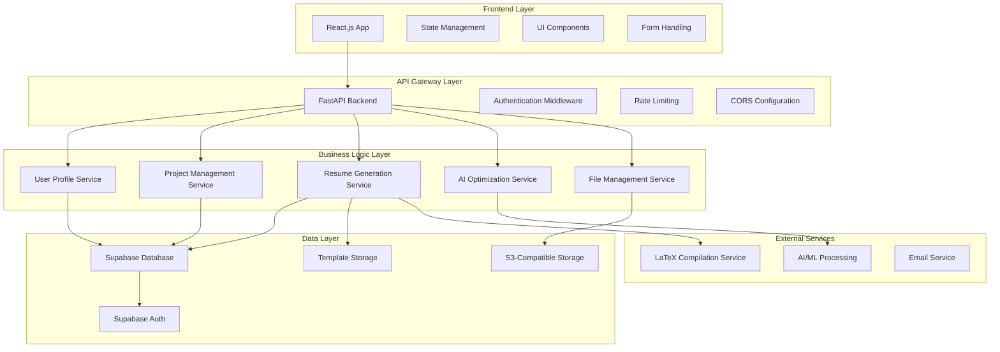

# Portfolio & Resume Generation Platform - System Architecture & Technical Specifications

## System Architecture Overview



## Technology Stack Specifications

### Frontend Technology Stack
```yaml
Framework: React.js 18+ with TypeScript
State Management: React Context API + useReducer
Styling: Tailwind CSS + Headless UI
Form Handling: React Hook Form + Zod validation
HTTP Client: Axios with interceptors
Routing: React Router v6
Build Tool: Vite
Testing: Vitest + React Testing Library
Deployment: Vercel/Netlify
```

### Backend Technology Stack
```yaml
Framework: FastAPI (Python 3.11+)
Database: Supabase PostgreSQL
Authentication: Supabase Auth
ORM: SQLAlchemy 2.0 with Alembic migrations
File Storage: AWS S3 compatible storage
Task Queue: Celery + Redis (for LaTeX compilation)
API Documentation: Auto-generated with FastAPI
Testing: pytest + httpx
Package Management: Astral UV (uv run, uv add)
Deployment: Railway/Render with Docker
```

### Database Schema Design

#### User Management Tables
```sql
-- Users table (extends Supabase auth.users)
CREATE TABLE profiles (
    id UUID REFERENCES auth.users PRIMARY KEY,
    email TEXT UNIQUE NOT NULL,
    full_name TEXT,
    phone TEXT,
    city TEXT,
    country TEXT,
    linkedin_url TEXT,
    github_url TEXT,
    portfolio_url TEXT,
    other_links JSONB,
    avatar_url TEXT,
    created_at TIMESTAMP DEFAULT NOW(),
    updated_at TIMESTAMP DEFAULT NOW()
);

-- Education table
CREATE TABLE education (
    id UUID PRIMARY KEY DEFAULT gen_random_uuid(),
    user_id UUID REFERENCES profiles(id) ON DELETE CASCADE,
    institution TEXT NOT NULL,
    degree TEXT NOT NULL,
    field_of_study TEXT,
    cgpa DECIMAL(3,2),
    percentage DECIMAL(5,2),
    graduation_year INTEGER,
    location TEXT,
    start_date DATE,
    end_date DATE,
    created_at TIMESTAMP DEFAULT NOW()
);
```

#### Project Management Tables
```sql
-- Projects table
CREATE TABLE projects (
    id UUID PRIMARY KEY DEFAULT gen_random_uuid(),
    user_id UUID REFERENCES profiles(id) ON DELETE CASCADE,
    title TEXT NOT NULL,
    description TEXT,
    short_description TEXT,
    category TEXT NOT NULL,
    technologies JSONB,
    github_url TEXT,
    live_url TEXT,
    start_date DATE,
    end_date DATE,
    status TEXT DEFAULT 'completed',
    is_featured BOOLEAN DEFAULT FALSE,
    created_at TIMESTAMP DEFAULT NOW(),
    updated_at TIMESTAMP DEFAULT NOW()
);

-- Project media (screenshots, etc.)
CREATE TABLE project_media (
    id UUID PRIMARY KEY DEFAULT gen_random_uuid(),
    project_id UUID REFERENCES projects(id) ON DELETE CASCADE,
    file_url TEXT NOT NULL,
    file_name TEXT,
    media_type TEXT,
    caption TEXT,
    display_order INTEGER,
    created_at TIMESTAMP DEFAULT NOW()
);
```

#### Professional Experience Tables
```sql
-- Professional certifications
CREATE TABLE certifications (
    id UUID PRIMARY KEY DEFAULT gen_random_uuid(),
    user_id UUID REFERENCES profiles(id) ON DELETE CASCADE,
    name TEXT NOT NULL,
    issuer TEXT NOT NULL,
    issue_date DATE,
    expiry_date DATE,
    credential_id TEXT,
    verification_url TEXT,
    certificate_file_url TEXT,
    created_at TIMESTAMP DEFAULT NOW()
);

-- Internship experiences
CREATE TABLE internships (
    id UUID PRIMARY KEY DEFAULT gen_random_uuid(),
    user_id UUID REFERENCES profiles(id) ON DELETE CASCADE,
    company TEXT NOT NULL,
    role TEXT NOT NULL,
    location TEXT,
    start_date DATE,
    end_date DATE,
    description TEXT,
    achievements JSONB,
    created_at TIMESTAMP DEFAULT NOW()
);

-- Courses completed
CREATE TABLE courses (
    id UUID PRIMARY KEY DEFAULT gen_random_uuid(),
    user_id UUID REFERENCES profiles(id) ON DELETE CASCADE,
    name TEXT NOT NULL,
    institution TEXT,
    completion_date DATE,
    certificate_url TEXT,
    skills_acquired JSONB,
    created_at TIMESTAMP DEFAULT NOW()
);

-- Extracurricular activities
CREATE TABLE activities (
    id UUID PRIMARY KEY DEFAULT gen_random_uuid(),
    user_id UUID REFERENCES profiles(id) ON DELETE CASCADE,
    title TEXT NOT NULL,
    organization TEXT,
    role TEXT,
    start_date DATE,
    end_date DATE,
    description TEXT,
    achievements JSONB,
    activity_type TEXT,
    created_at TIMESTAMP DEFAULT NOW()
);
```

#### Resume Generation Tables
```sql
-- LaTeX templates
CREATE TABLE templates (
    id UUID PRIMARY KEY DEFAULT gen_random_uuid(),
    name TEXT NOT NULL,
    category TEXT NOT NULL,
    description TEXT,
    latex_content TEXT NOT NULL,
    css_styles TEXT,
    preview_image_url TEXT,
    is_public BOOLEAN DEFAULT TRUE,
    download_count INTEGER DEFAULT 0,
    created_by UUID REFERENCES profiles(id),
    created_at TIMESTAMP DEFAULT NOW(),
    updated_at TIMESTAMP DEFAULT NOW()
);

-- User resume versions
CREATE TABLE resume_versions (
    id UUID PRIMARY KEY DEFAULT gen_random_uuid(),
    user_id UUID REFERENCES profiles(id) ON DELETE CASCADE,
    template_id UUID REFERENCES templates(id),
    title TEXT NOT NULL,
    job_description TEXT,
    optimized_content JSONB,
    latex_content TEXT,
    pdf_url TEXT,
    is_ai_optimized BOOLEAN DEFAULT FALSE,
    optimization_score INTEGER,
    created_at TIMESTAMP DEFAULT NOW(),
    updated_at TIMESTAMP DEFAULT NOW()
);

-- AI optimization history
CREATE TABLE optimization_history (
    id UUID PRIMARY KEY DEFAULT gen_random_uuid(),
    resume_version_id UUID REFERENCES resume_versions(id) ON DELETE CASCADE,
    job_description TEXT NOT NULL,
    keywords_extracted JSONB,
    optimization_applied JSONB,
    before_score INTEGER,
    after_score INTEGER,
    created_at TIMESTAMP DEFAULT NOW()
);
```

#### File Management Tables
```sql
-- File uploads
CREATE TABLE file_uploads (
    id UUID PRIMARY KEY DEFAULT gen_random_uuid(),
    user_id UUID REFERENCES profiles(id) ON DELETE CASCADE,
    original_filename TEXT NOT NULL,
    file_path TEXT NOT NULL,
    file_size BIGINT,
    mime_type TEXT,
    file_category TEXT,
    upload_status TEXT DEFAULT 'pending',
    created_at TIMESTAMP DEFAULT NOW()
);
```

## API Endpoints Specification

### Authentication Endpoints
```yaml
POST /auth/login
POST /auth/register  
POST /auth/logout
POST /auth/refresh
GET  /auth/me
```

### Profile Management Endpoints
```yaml
GET    /api/profile
PUT    /api/profile
POST   /api/profile/avatar
GET    /api/education
POST   /api/education
PUT    /api/education/{id}
DELETE /api/education/{id}
```

### Project Management Endpoints
```yaml
GET    /api/projects
POST   /api/projects
GET    /api/projects/{id}
PUT    /api/projects/{id}
DELETE /api/projects/{id}
POST   /api/projects/{id}/media
DELETE /api/projects/{id}/media/{media_id}
```

### Professional Experience Endpoints
```yaml
GET    /api/certifications
POST   /api/certifications
PUT    /api/certifications/{id}
DELETE /api/certifications/{id}

GET    /api/internships
POST   /api/internships
PUT    /api/internships/{id}
DELETE /api/internships/{id}

GET    /api/courses
POST   /api/courses
PUT    /api/courses/{id}
DELETE /api/courses/{id}

GET    /api/activities
POST   /api/activities
PUT    /api/activities/{id}
DELETE /api/activities/{id}
```

### Resume Generation Endpoints
```yaml
GET    /api/templates
GET    /api/templates/{id}
POST   /api/templates/{id}/customize

POST   /api/resume/generate
GET    /api/resume/{id}
PUT    /api/resume/{id}
DELETE /api/resume/{id}
POST   /api/resume/{id}/optimize
GET    /api/resume/{id}/download
```

### File Management Endpoints
```yaml
POST   /api/upload
GET    /api/files
GET    /api/files/{id}
DELETE /api/files/{id}
GET    /api/files/{id}/signed-url
```

## AI Optimization Algorithm Design

### Keyword Extraction Process
```python
def extract_keywords(job_description: str) -> Dict[str, List[str]]:
    # Text preprocessing
    cleaned_text = preprocess_text(job_description)
    
    # Industry-specific keyword sets
    tech_keywords = load_technology_keywords()
    skills_keywords = load_skills_keywords()
    
    # Extract using multiple methods
    tfidf_keywords = extract_tfidf_keywords(cleaned_text, tech_keywords)
    skills_keywords_found = extract_skills_matches(cleaned_text, skills_keywords)
    
    # Combine and rank
    return {
        'technical_skills': tfidf_keywords,
        'soft_skills': skills_keywords_found['soft_skills'],
        'industry_terms': skills_keywords_found['industry_terms'],
        'experience_indicators': extract_experience_indicators(cleaned_text)
    }
```

### Content Optimization Process
```python
def optimize_resume_content(user_data: Dict, job_keywords: Dict) -> Dict:
    # Score content relevance
    content_scores = score_content_relevance(user_data, job_keywords)
    
    # Prioritize sections based on job requirements
    prioritized_sections = prioritize_sections(user_data, job_keywords)
    
    # Apply keyword optimization
    optimized_content = apply_keyword_optimization(
        prioritized_sections, 
        job_keywords
    )
    
    # Format for ATS compatibility
    ats_optimized = optimize_for_ats(optimized_content)
    
    return {
        'optimized_content': ats_optimized,
        'optimization_score': calculate_optimization_score(content_scores),
        'recommendations': generate_recommendations(content_scores)
    }
```

### Template Recommendation Algorithm
```python
def recommend_template(user_profile: Dict, job_description: str) -> Template:
    # Analyze job type and requirements
    job_profile = analyze_job_requirements(job_description)
    
    # Consider user preferences and history
    user_preferences = get_user_template_preferences(user_profile['user_id'])
    
    # Score available templates
    template_scores = []
    for template in get_available_templates():
        score = calculate_template_fit_score(template, job_profile, user_preferences)
        template_scores.append((template, score))
    
    # Return highest scoring template
    return max(template_scores, key=lambda x: x[1])[0]
```

## Security Implementation

### Authentication & Authorization
```yaml
JWT Configuration:
  Access Token: 15 minutes expiry
  Refresh Token: 7 days expiry
  Algorithm: RS256
  
Role-Based Access Control:
  User: Full access to own data
  Admin: Access to public templates and analytics
  
Row Level Security (RLS):
  Enabled on all user tables
  Users can only access their own records
```

### Data Protection
```yaml
Encryption:
  At Rest: AES-256 for sensitive data
  In Transit: TLS 1.3 for all communications
  
File Upload Security:
  Virus scanning on upload
  File type validation
  Size limits (10MB per file)
  Secure file naming
  
Privacy Compliance:
  GDPR compliance for EU users
  Data retention policies
  User data export functionality
  Right to deletion
```

### Rate Limiting & DDoS Protection
```yaml
API Rate Limits:
  Auth endpoints: 5 requests per minute
  File uploads: 10 requests per hour
  Resume generation: 20 requests per hour
  General API: 100 requests per minute
  
DDoS Protection:
  Cloudflare integration
  IP-based blocking
  Request validation
```

## Performance Optimization

### Database Optimization
```sql
-- Indexes for common queries
CREATE INDEX idx_projects_user_id ON projects(user_id);
CREATE INDEX idx_projects_category ON projects(category);
CREATE INDEX idx_education_user_id ON education(user_id);
CREATE INDEX idx_resume_versions_user_id ON resume_versions(user_id);
CREATE INDEX idx_optimization_history_resume_id ON optimization_history(resume_version_id);

-- Full-text search indexes
CREATE INDEX idx_projects_search ON projects USING gin(to_tsvector('english', title || ' ' || description));
```

### Caching Strategy
```yaml
Application Cache:
  Redis for session storage
  Template cache (1 hour TTL)
  File metadata cache (30 minutes TTL)
  
Database Cache:
  Connection pooling
  Read replicas for heavy queries
  Query result caching
  
CDN Strategy:
  Static assets via Cloudflare
  Template previews via CDN
  File downloads via signed URLs
```

### LaTeX Compilation Optimization
```yaml
Compilation Queue:
  Celery workers for async processing
  Priority queue for urgent requests
  Compilation result caching
  
Performance Monitoring:
  Compilation time tracking
  Error rate monitoring
  Resource usage optimization
```

## Monitoring & Analytics

### Application Monitoring
```yaml
Health Checks:
  Database connectivity
  External service availability
  File storage accessibility
  
Performance Metrics:
  API response times
  Database query performance
  LaTeX compilation success rate
  
Error Tracking:
  Centralized error logging
  User session tracking
  Performance bottleneck identification
```

### User Analytics
```yaml
Key Metrics:
  User registration rate
  Profile completion rate
  Resume generation frequency
  Template usage patterns
  AI optimization effectiveness
  
Privacy-Respecting Analytics:
  Anonymized user behavior tracking
  Feature usage statistics
  Conversion funnel analysis
```

## Deployment Architecture

### Development Environment
```yaml
Local Development:
  Docker Compose for local services
  Hot reload for both frontend and backend
  Local Supabase instance for testing
  
Staging Environment:
  Railway/Render for backend hosting
  Vercel for frontend hosting
  Test database with sample data
```

### Production Environment
```yaml
Frontend Hosting:
  Vercel/Netlify deployment
  CDN distribution
  Automatic SSL certificates
  
Backend Hosting:
  Railway/Render containerized deployment
  Multi-region availability
  Auto-scaling based on load
  
Database:
  Supabase managed PostgreSQL
  Automated backups
  Read replicas for scaling
```

### CI/CD Pipeline
```yaml
GitHub Actions Workflow:
  Code quality checks (ESLint, Black, mypy)
  Automated testing (unit, integration)
  Security scanning (dependency vulnerabilities)
  Docker image building
  Automated deployment to staging
  Manual approval for production deployment
```

## Scalability Considerations

### Horizontal Scaling
```yaml
Database Scaling:
  Read replicas for query distribution
  Connection pooling optimization
  Query optimization and indexing
  
Application Scaling:
  Stateless API design
  Load balancer configuration
  Auto-scaling based on metrics
```

### Performance Budgets
```yaml
Frontend:
  Initial page load: < 3 seconds
  Time to interactive: < 5 seconds
  Bundle size: < 500KB
  
Backend:
  API response time: < 500ms
  Resume generation: < 30 seconds
  File upload: < 10 seconds
```

### Future Enhancements
```yaml
Advanced Features:
  Machine learning for better recommendations
  Integration with job boards
  Collaborative resume building
  Advanced analytics dashboard
  
Platform Expansion:
  Mobile app development
  API for third-party integrations
  White-label solution for organizations
  Multi-language support