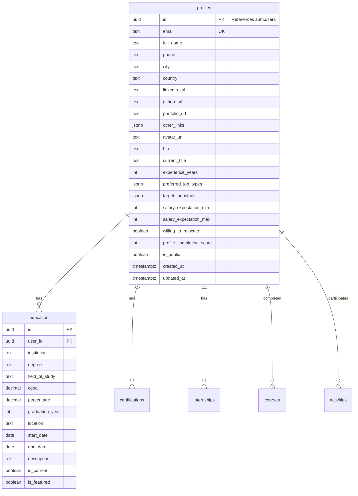
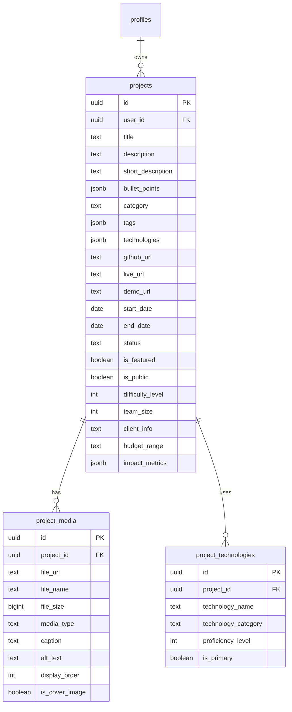
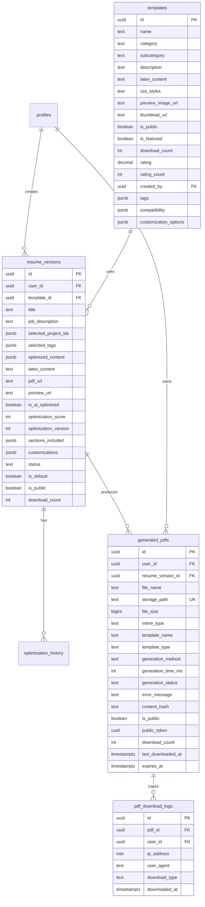

# Resume Twin - Database Schema Reference

## Quick Reference

| Table | Description | RLS Enabled |
|-------|-------------|-------------|
| `profiles` | User profile information | ✅ |
| `education` | Educational background | ✅ |
| `projects` | Portfolio projects | ✅ |
| `project_media` | Project screenshots/media | ✅ |
| `project_technologies` | Technologies per project | ✅ |
| `certifications` | Professional certifications | ✅ |
| `internships` | Internship experiences | ✅ |
| `courses` | Completed courses | ✅ |
| `activities` | Extracurricular activities | ✅ |
| `templates` | Resume templates | ✅ |
| `template_ratings` | User ratings for templates | ✅ |
| `resume_versions` | Generated resume versions | ✅ |
| `optimization_history` | AI optimization logs | ✅ |
| `file_uploads` | General file uploads | ✅ |
| `generated_pdfs` | Stored PDF files | ✅ |
| `pdf_download_logs` | Download audit trail | ✅ |

---

## Schema Diagrams

### Core User Schema



### Project Schema



### Resume & PDF Schema



---

## Table Details

### `profiles`

Extends Supabase `auth.users` with additional profile information.

```sql
CREATE TABLE profiles (
    id UUID REFERENCES auth.users PRIMARY KEY,
    email TEXT UNIQUE NOT NULL,
    full_name TEXT,
    phone TEXT,
    city TEXT,
    country TEXT,
    linkedin_url TEXT,
    github_url TEXT,
    portfolio_url TEXT,
    other_links JSONB DEFAULT '{}',
    avatar_url TEXT,
    bio TEXT,
    current_title TEXT,
    experience_years INTEGER DEFAULT 0,
    preferred_job_types JSONB DEFAULT '[]',
    target_industries JSONB DEFAULT '[]',
    salary_expectation_min INTEGER,
    salary_expectation_max INTEGER,
    willing_to_relocate BOOLEAN DEFAULT FALSE,
    profile_completion_score INTEGER DEFAULT 0,
    is_public BOOLEAN DEFAULT FALSE,
    created_at TIMESTAMP WITH TIME ZONE DEFAULT NOW(),
    updated_at TIMESTAMP WITH TIME ZONE DEFAULT NOW()
);
```

**RLS Policies:**
- `SELECT`: View public profiles or own profile
- `INSERT`: Only own profile (auth.uid() = id)
- `UPDATE`: Only own profile

---

### `projects`

User's portfolio projects with tagging and categorization.

```sql
CREATE TABLE projects (
    id UUID PRIMARY KEY DEFAULT gen_random_uuid(),
    user_id UUID REFERENCES profiles(id) ON DELETE CASCADE,
    title TEXT NOT NULL,
    description TEXT,
    short_description TEXT,
    bullet_points JSONB DEFAULT '[]',
    category TEXT NOT NULL,
    tags JSONB DEFAULT '[]',
    technologies JSONB DEFAULT '[]',
    github_url TEXT,
    live_url TEXT,
    demo_url TEXT,
    start_date DATE,
    end_date DATE,
    status TEXT DEFAULT 'completed',
    is_featured BOOLEAN DEFAULT FALSE,
    is_public BOOLEAN DEFAULT FALSE,
    difficulty_level INTEGER CHECK (difficulty_level BETWEEN 1 AND 5),
    team_size INTEGER DEFAULT 1,
    client_info TEXT,
    budget_range TEXT,
    impact_metrics JSONB DEFAULT '{}',
    created_at TIMESTAMP WITH TIME ZONE DEFAULT NOW(),
    updated_at TIMESTAMP WITH TIME ZONE DEFAULT NOW()
);
```

**Example `bullet_points` JSONB:**
```json
[
    "Developed RESTful API with 99.9% uptime",
    "Reduced load time by 40% through optimization",
    "Integrated CI/CD pipeline with automated testing"
]
```

**Example `tags` JSONB:**
```json
["web-development", "full-stack", "e-commerce", "payment-integration"]
```

---

### `generated_pdfs`

Stores metadata for PDFs in Supabase Storage.

```sql
CREATE TABLE generated_pdfs (
    id UUID PRIMARY KEY DEFAULT gen_random_uuid(),
    user_id UUID NOT NULL REFERENCES profiles(id) ON DELETE CASCADE,
    resume_version_id UUID REFERENCES resume_versions(id) ON DELETE SET NULL,
    file_name TEXT NOT NULL,
    storage_path TEXT NOT NULL UNIQUE,
    file_size BIGINT NOT NULL,
    mime_type TEXT DEFAULT 'application/pdf',
    template_name TEXT,
    template_type TEXT DEFAULT 'html',
    generation_method TEXT NOT NULL,
    generation_time_ms INTEGER,
    generation_status TEXT DEFAULT 'completed',
    error_message TEXT,
    content_hash TEXT,
    is_public BOOLEAN DEFAULT FALSE,
    public_token UUID DEFAULT gen_random_uuid(),
    download_count INTEGER DEFAULT 0,
    last_downloaded_at TIMESTAMP WITH TIME ZONE,
    expires_at TIMESTAMP WITH TIME ZONE,
    created_at TIMESTAMP WITH TIME ZONE DEFAULT NOW(),
    updated_at TIMESTAMP WITH TIME ZONE DEFAULT NOW()
);
```

**Storage Path Convention:**
```
resumes/{user_id}/{pdf_id}.pdf
```

**Generation Methods:**
- `pdfshift` - PDFShift cloud API
- `browserless` - Browserless cloud API
- `html2pdf` - HTML2PDF.app API
- `weasyprint` - Local WeasyPrint (if GTK installed)
- `latex` - LaTeX compilation

---

### `pdf_download_logs`

Audit trail for PDF downloads.

```sql
CREATE TABLE pdf_download_logs (
    id UUID PRIMARY KEY DEFAULT gen_random_uuid(),
    pdf_id UUID NOT NULL REFERENCES generated_pdfs(id) ON DELETE CASCADE,
    user_id UUID REFERENCES profiles(id) ON DELETE SET NULL,
    ip_address INET,
    user_agent TEXT,
    download_type TEXT DEFAULT 'direct',
    downloaded_at TIMESTAMP WITH TIME ZONE DEFAULT NOW()
);
```

**Download Types:**
- `direct` - Streamed through API
- `presigned_url` - Via presigned S3 URL
- `public_link` - Via public sharing token

---

## Indexes

### Performance Indexes

```sql
-- Profiles
CREATE INDEX idx_profiles_email ON profiles(email);
CREATE INDEX idx_profiles_current_title ON profiles(current_title);

-- Projects
CREATE INDEX idx_projects_user_id ON projects(user_id);
CREATE INDEX idx_projects_category ON projects(category);
CREATE INDEX idx_projects_status ON projects(status);
CREATE INDEX idx_projects_tags ON projects USING gin(tags);
CREATE INDEX idx_projects_search ON projects 
    USING gin(to_tsvector('english', title || ' ' || COALESCE(description, '')));

-- Generated PDFs
CREATE INDEX idx_generated_pdfs_user_id ON generated_pdfs(user_id);
CREATE INDEX idx_generated_pdfs_user_created ON generated_pdfs(user_id, created_at DESC);
CREATE INDEX idx_generated_pdfs_storage_path ON generated_pdfs(storage_path);
CREATE INDEX idx_generated_pdfs_public_token ON generated_pdfs(public_token) 
    WHERE is_public = true;
CREATE INDEX idx_generated_pdfs_expires_at ON generated_pdfs(expires_at) 
    WHERE expires_at IS NOT NULL;

-- Download Logs
CREATE INDEX idx_pdf_download_logs_pdf_id ON pdf_download_logs(pdf_id);
CREATE INDEX idx_pdf_download_logs_downloaded_at ON pdf_download_logs(downloaded_at DESC);
```

---

## Functions & Triggers

### Auto-update `updated_at`

```sql
CREATE OR REPLACE FUNCTION update_updated_at_column()
RETURNS TRIGGER AS $$
BEGIN
    NEW.updated_at = NOW();
    RETURN NEW;
END;
$$ LANGUAGE plpgsql;

-- Apply to all tables with updated_at
CREATE TRIGGER update_profiles_updated_at 
    BEFORE UPDATE ON profiles
    FOR EACH ROW EXECUTE FUNCTION update_updated_at_column();
```

### Increment Download Count

```sql
CREATE OR REPLACE FUNCTION increment_pdf_download_count(pdf_uuid UUID)
RETURNS VOID AS $$
BEGIN
    UPDATE generated_pdfs 
    SET 
        download_count = download_count + 1,
        last_downloaded_at = NOW()
    WHERE id = pdf_uuid;
END;
$$ LANGUAGE plpgsql SECURITY DEFINER;
```

### Cleanup Expired PDFs

```sql
CREATE OR REPLACE FUNCTION cleanup_expired_pdfs()
RETURNS INTEGER AS $$
DECLARE
    deleted_count INTEGER;
BEGIN
    WITH deleted AS (
        DELETE FROM generated_pdfs 
        WHERE expires_at IS NOT NULL 
        AND expires_at < NOW()
        RETURNING id
    )
    SELECT COUNT(*) INTO deleted_count FROM deleted;
    
    RETURN deleted_count;
END;
$$ LANGUAGE plpgsql SECURITY DEFINER;
```

---

## Views

### User PDF Summary

```sql
CREATE OR REPLACE VIEW user_pdf_summary AS
SELECT 
    user_id,
    COUNT(*) as total_pdfs,
    SUM(file_size) as total_storage_bytes,
    SUM(download_count) as total_downloads,
    MAX(created_at) as last_pdf_created,
    COUNT(*) FILTER (WHERE generation_status = 'completed') as successful_generations,
    COUNT(*) FILTER (WHERE generation_status = 'failed') as failed_generations
FROM generated_pdfs
GROUP BY user_id;
```

### Profile Completion

```sql
CREATE VIEW profile_completion AS
SELECT 
    p.id,
    p.full_name,
    p.email,
    CASE WHEN EXISTS (SELECT 1 FROM education e WHERE e.user_id = p.id) 
         THEN 1 ELSE 0 END as has_education,
    CASE WHEN EXISTS (SELECT 1 FROM projects pr WHERE pr.user_id = p.id) 
         THEN 1 ELSE 0 END as has_projects,
    COUNT(pr.id) as project_count
FROM profiles p
LEFT JOIN projects pr ON pr.user_id = p.id
GROUP BY p.id, p.full_name, p.email;
```

---

## Migration Scripts

### Apply Schema

```bash
# Full schema
psql $DATABASE_URL -f database/schema.sql

# PDF storage migration
psql $DATABASE_URL -f database/migrations/001_add_generated_pdfs_table.sql
```

### Rollback

```sql
-- Rollback PDF storage
DROP TABLE IF EXISTS pdf_download_logs;
DROP TABLE IF EXISTS generated_pdfs;
DROP FUNCTION IF EXISTS increment_pdf_download_count(UUID);
DROP FUNCTION IF EXISTS cleanup_expired_pdfs();
DROP VIEW IF EXISTS user_pdf_summary;
DROP VIEW IF EXISTS recent_pdf_downloads;
```

---

## Related Documentation

- [Database Architecture](./database-architecture.md) - ER diagrams and flow
- [System Flowcharts](./system-flowcharts.md) - Process flows
- [API Reference](./api-reference.md) - Endpoint documentation
