# Resume Twin - System Flowcharts

## Table of Contents

1. [System Overview](#system-overview)
2. [User Authentication Flow](#user-authentication-flow)
3. [Resume Generation Pipeline](#resume-generation-pipeline)
4. [PDF Storage & Retrieval](#pdf-storage--retrieval)
5. [Project Management Flow](#project-management-flow)
6. [AI Optimization Flow](#ai-optimization-flow)

---

## System Overview

### High-Level Architecture

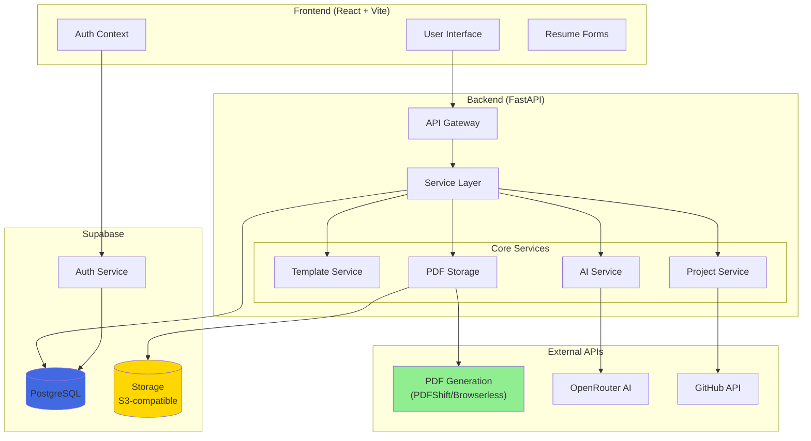

---

## User Authentication Flow

### Login Process

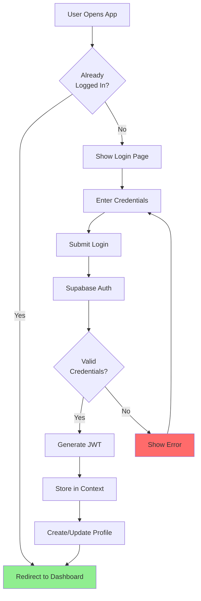

### Registration Process

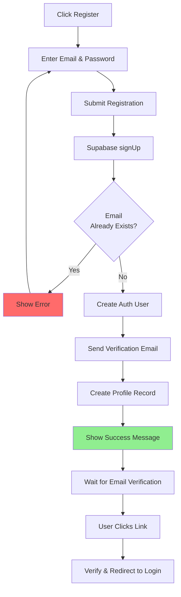

---

## Resume Generation Pipeline

### Complete Generation Flow

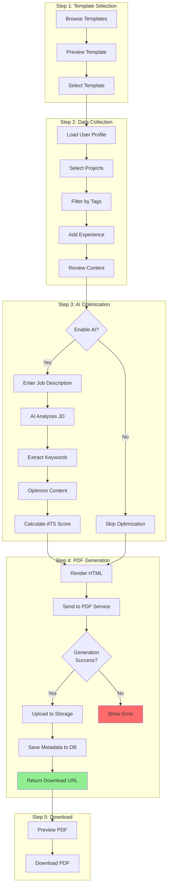

### PDF Generation Methods

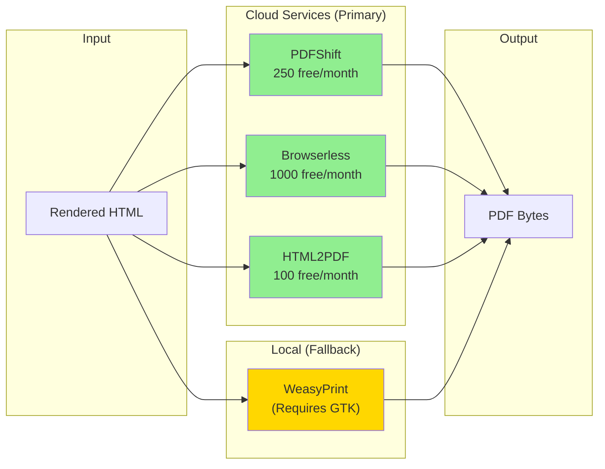

---

## PDF Storage & Retrieval

### Storage Flow

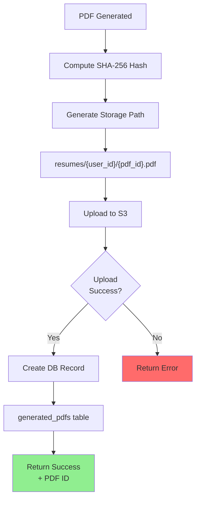

### Download Flow

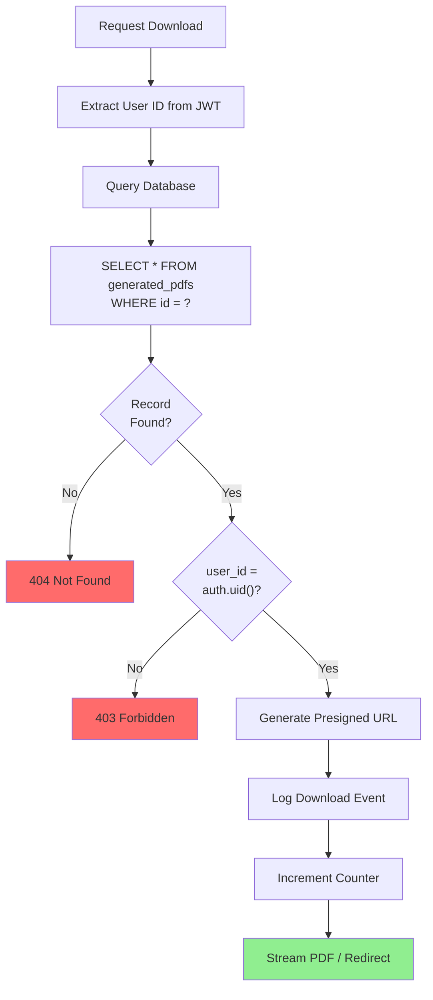

### Public Sharing Flow

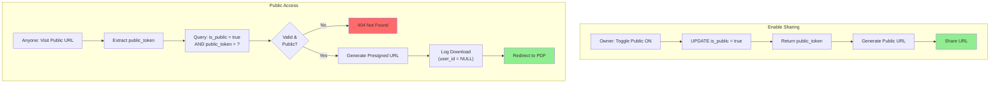

---

## Project Management Flow

### Add Project

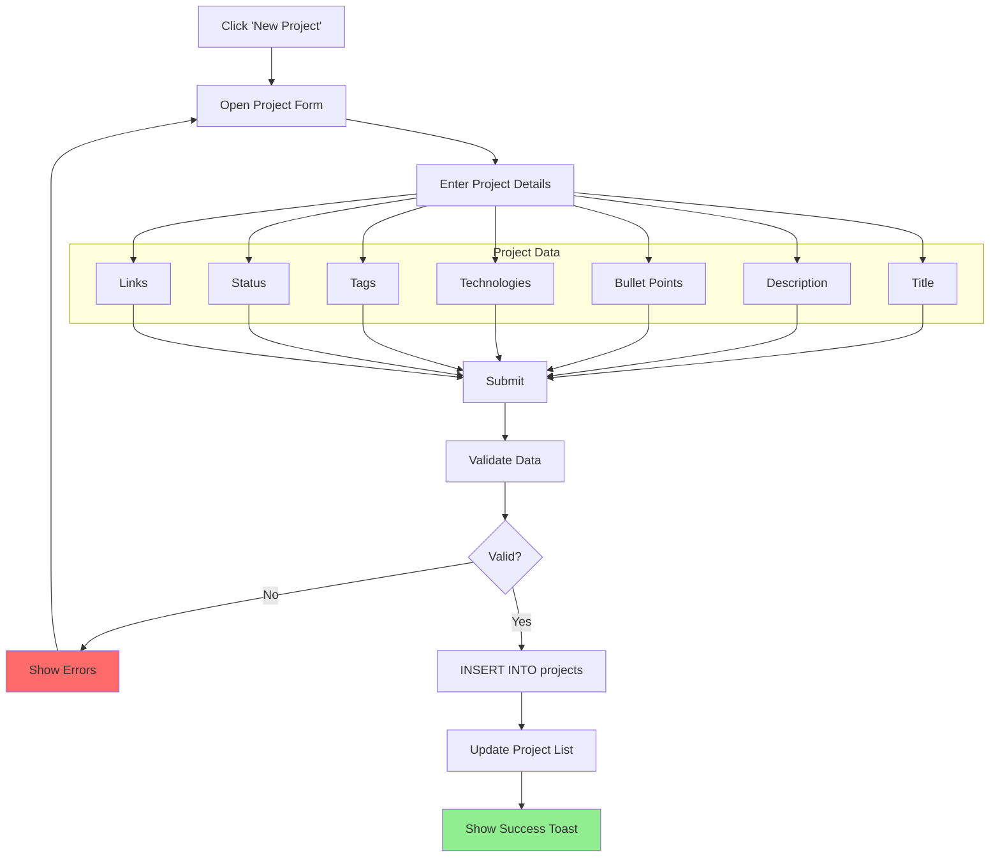

### Tag-Based Filtering

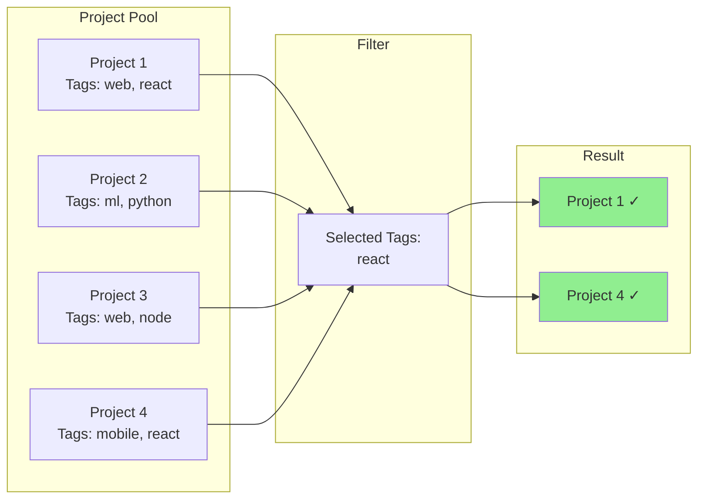

---

## AI Optimization Flow

### Content Optimization

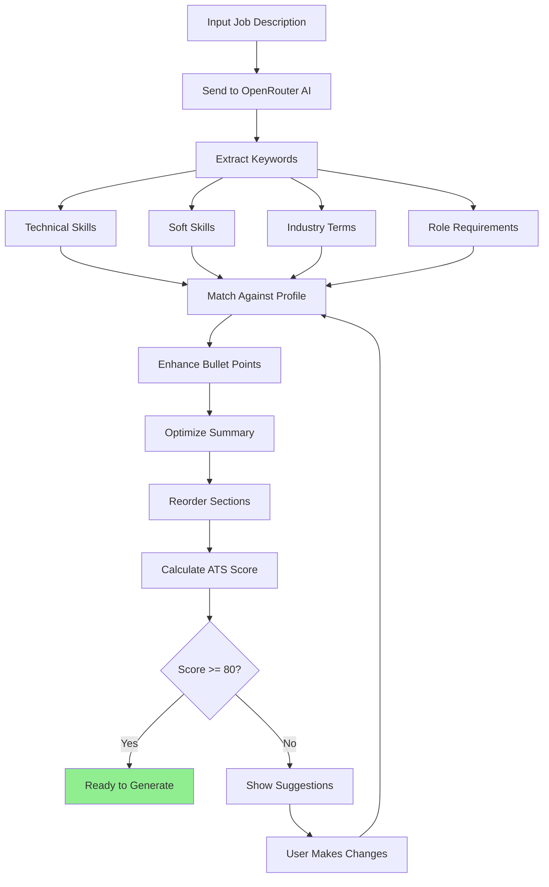

### ATS Score Calculation

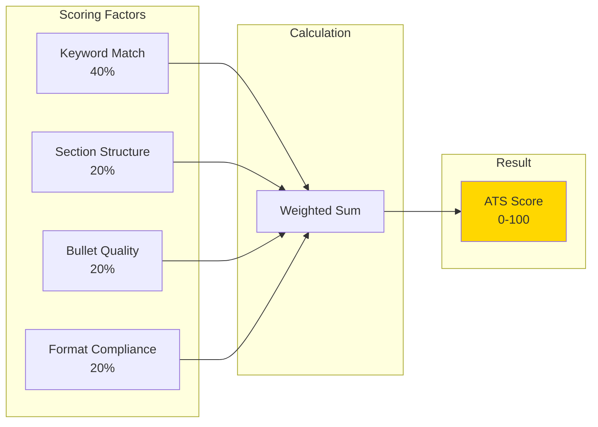

---

## Error Handling Flow

### Global Error Handler

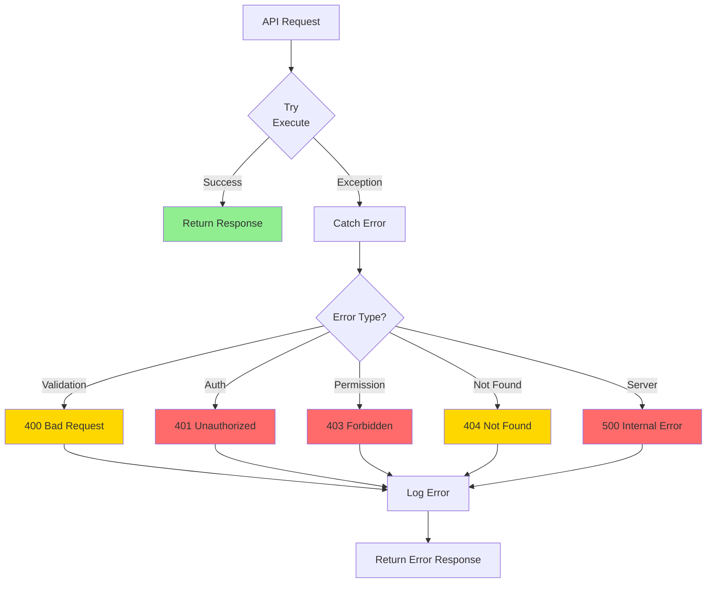

---

## Security Flow

### Request Authentication

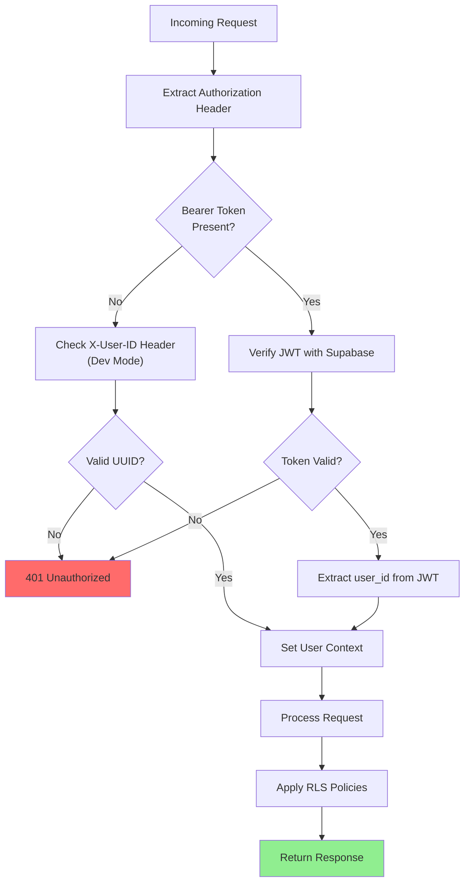

---

## Deployment Flow

### CI/CD Pipeline

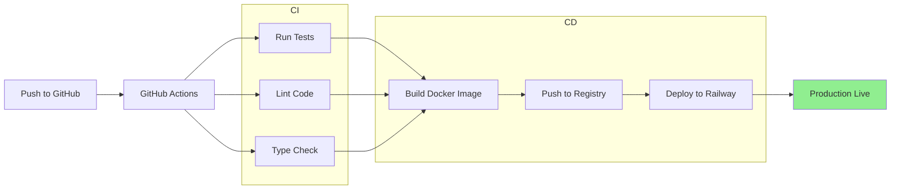

---

## Related Documentation

- [Database Architecture](./database-architecture.md)
- [API Documentation](./api-reference.md)
- [Implementation Workflow](./implementation_workflow.md)
